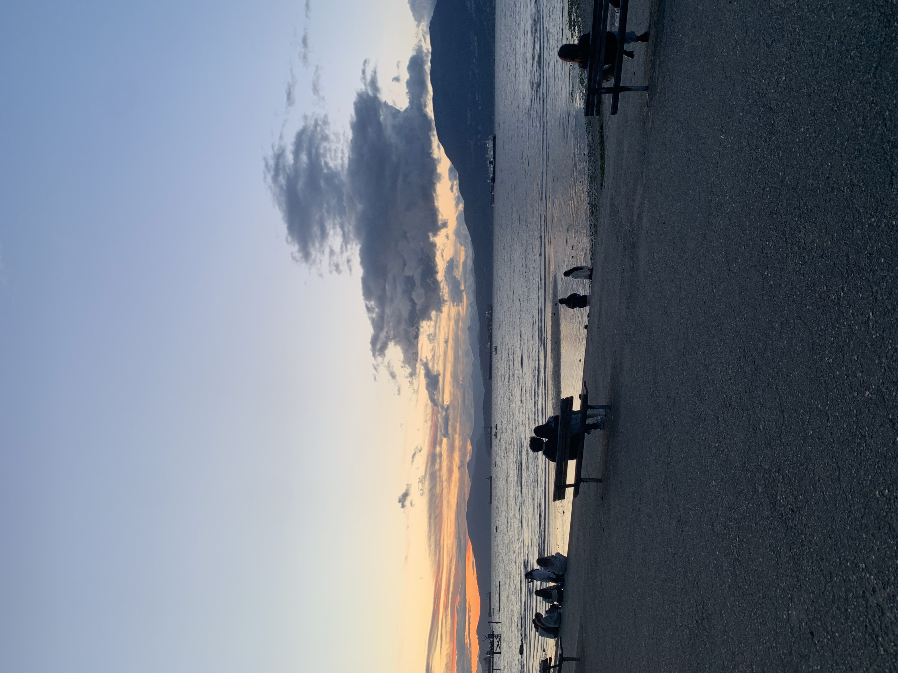
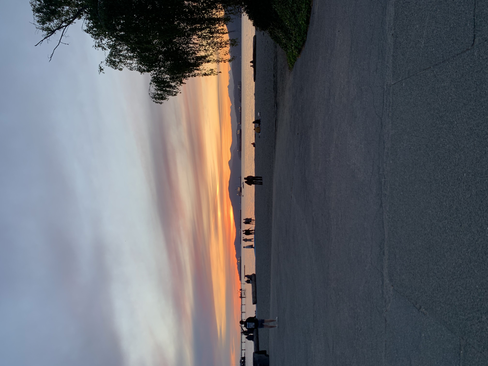
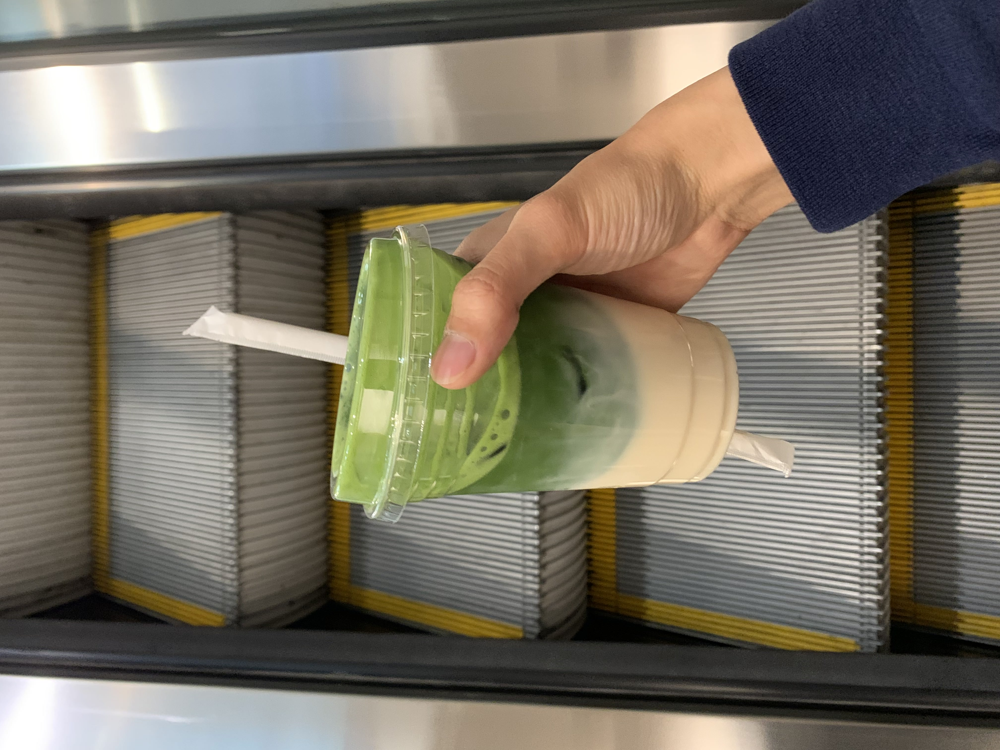
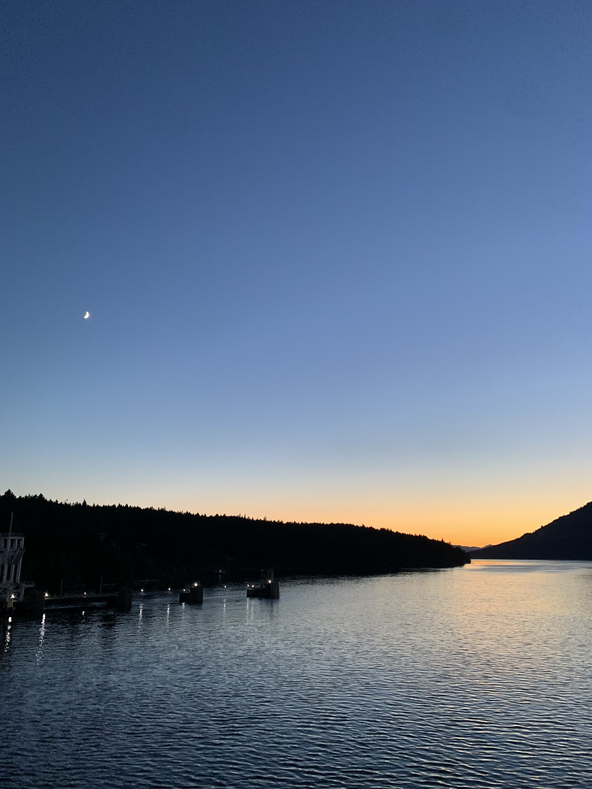
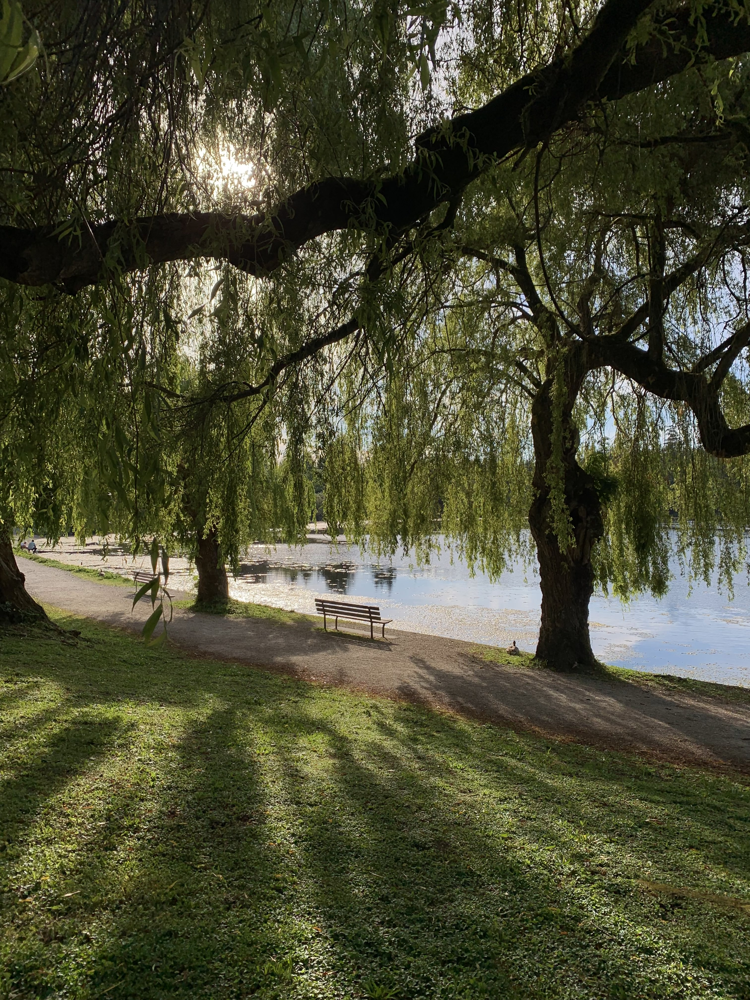
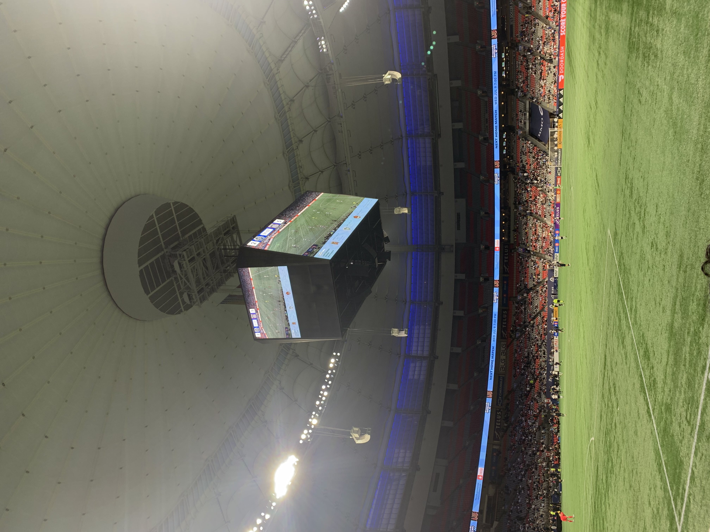
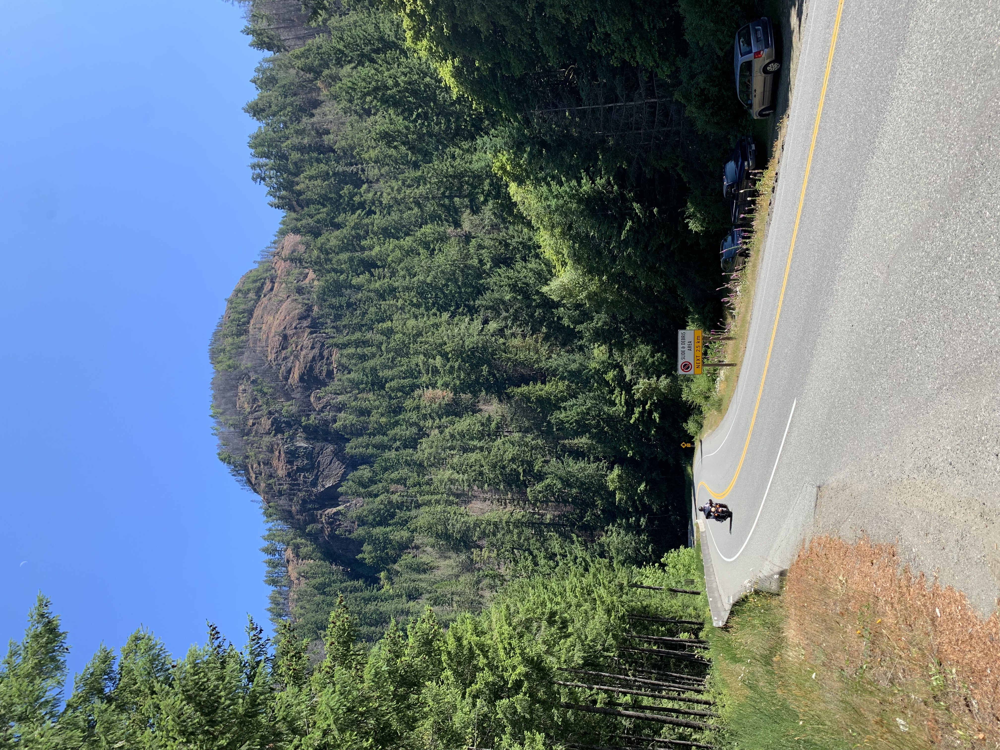
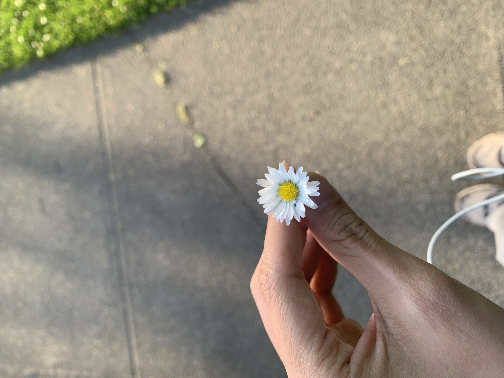
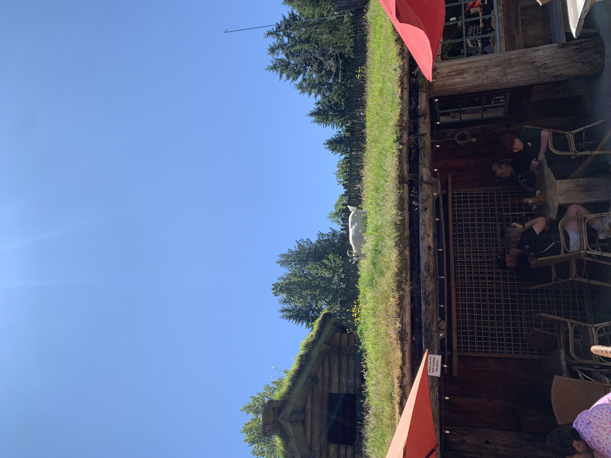

# life update
### july 11, 2025

It's been a while! I've been busy with a bunch of things - including moving to a new city for the summer.

Currently, I'm working at Asana as a data science intern in the beautiful city of Vancouver, BC.

I moved here on May 5, so it's been just over two months. In that time, I've gained a lot of new perspectives - some good, some bad.

The nature here is unreal. Everywhere I go, the mountains peek out from behind buildings, quietly reminding me that they're always there. I think it took me a while to fully process that this is where I'd be living for a few months. The people here seem a lot happier, too. Maybe it's because they spend more time outside?

At the end of May, I bought a road bike off Facebook Marketplace for a pretty good deal - a super light carbon frame with Shimano Ultegra components. I named her Nova, since she's as fast as a shooting star. I've been biking around the city, discovering new places and revisiting old ones. My goal is to hit 500km by the end of the summer. Definitely doable! I've also been in a solid routine of going to the office every day. So far, I've only worked from home twice. I honestly feel more productive than I've ever been.

I also discovered what might be the best matcha I've ever had from a cafe called Paragon Tea Room. They have a little pop-up in the basement level of the Pacific Centre. They use ceremonial-grade matcha mixed with oat milk and a touch of sweetness. It's smooth, sweet, and rich. I'm one stamp away on my loyalty card from redeeming a free matcha!

Experience a new city has been really nice, but I've also been feeling a little homesick. This is my first time being away from home for an extended period of time, and it's taught me to be independent - even more so than when I'm back on campus. I'd say my cooking skills have improved by at least 10%. The first few weeks I experimented with bland pasta recipes, but I've slowly learned to properly season my meals. I really miss my mom's cooking and Asian food in general. There's an abundance of Asian restaurants in the Vancouver area, but eating out isn't sustainable :(

Since the beginning of April, I've also been journalling every day. I write a single page for each day, no matter how tired I am or no matter how boring my day was. It's been adding a sense of rhythm to my life and helps me stay grounded. It acts as a vessel for my emotions and helps me understand 1. how I'm feeling and 2. why I'm feeling that way. There have been days where I felt alone or where my headspace wasn't the greatest. To this day, I'm still working through some personal things, but journalling has helped me in reminding myself that things will get better. I just have to keep working hard and pushing through!

Another thing that I've been exploring is videography. A few months ago, I was gifted a DJI Osmo Pocket 3. I've been recording stills of nature and cityscapes, hoping to stitch it all together and colour grade it when I'm back in Toronto. Maybe after I get a new laptop... since my current one struggles to keep one tab of Chrome open.

But yeah! That's a little update from me. I've still got around two months left of my internship, and I'm going to keep working hard and giving it my all :)

Here's a little photo dump ↓

